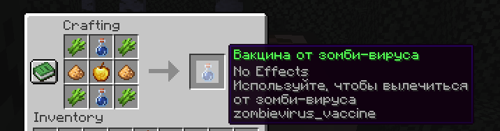

# ZombieVirus

Плагин для Minecraft, добавляющий систему зомби-вируса с различными стадиями заражения и системой вакцинации.

## Особенности

### Система заражения
- 20% шанс встретить зараженного зомби
- 4 стадии заражения с различными эффектами
- Прогрессирующие симптомы
- Возможность заражать других игроков

### Система вакцинации
- Создание вакцины по специальному рецепту
- Лечение зараженных игроков
- Визуальные эффекты при использовании



## Команды

- `/zombievirus status` - Проверить статус заражения
- `/zombievirus cure <игрок>` - Вылечить игрока
- `/zombievirus reload` - Перезагрузить конфигурацию

## Права

- `zombievirus.status` - Доступ к команде status
- `zombievirus.cure` - Доступ к команде cure
- `zombievirus.reload` - Доступ к команде reload

## Конфигурация

```yaml
# Шанс заражения от зомби (0.0 - 1.0)
infection-chance: 0.2

# Длительность каждой стадии в секундах
stage-duration: 300

# Сообщения
messages:
  prefix: "&8[&#FF5555ZombieVirus&8] &r"
  reload: "&aКонфигурация перезагружена!"
  no-permission: "&cУ вас нет прав для использования этой команды!"
  command-help: "&cИспользование: /zombievirus <status|cure|reload>"
  player-only: "&cЭта команда только для игроков!"
  cure-usage: "&cИспользование: /zombievirus cure <игрок>"
  player-not-found: "&cИгрок не найден!"
  player-cured: "&aИгрок %s был вылечен."
  infected: "&cВы были заражены зомби-вирусом!"
  stage-progress: "&cВаша инфекция прогрессирует до стадии %d!"
  cured: "&aВы были вылечены от зомби-вируса!"
  already-infected: "&cВы уже заражены!"
  not-infected: "&cВы не заражены!"
  zombie-name: "&cЗараженный зомби"
  vaccine-name: "&aВакцина от зомби-вируса"
  vaccine-lore-1: "&7Используйте, чтобы вылечиться"
  vaccine-lore-2: "&7от зомби-вируса"
  vaccine-created: "&aВы создали вакцину от зомби-вируса!"
  vaccine-used: "&aВы использовали вакцину!"
  vaccine-failed: "&cНе удалось создать вакцину!"
```

## Требования

- Spigot/Paper 1.12.1 или выше
- Java 24 или выше

## Установка

1. Скачайте последнюю версию плагина
2. Поместите файл .jar в папку plugins
3. Перезапустите сервер
4. Настройте конфигурацию в файле config.yml

## Лицензия

MIT License 